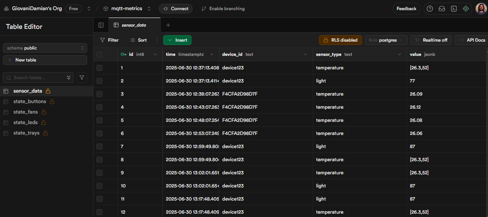

# mqtt-to-db

A TypeScript service that consumes metrics from an MQTT broker and stores them in a Supabase (PostgreSQL) database via HTTP client.

## 📋 Table of Contents

- [Overview](#overview)
- [Requirements](#requirements)
- [Installation](#installation)
- [Configuration](#configuration)
- [Project Structure](#project-structure)
- [Data Validation](#data-validation)
- [Usage](#usage)
- [Publishing Tests](#publishing-tests)
- [Screenshots] (#screenshots)

---

## Overview

This project implements a service that:

1. Connects to an MQTT broker (e.g. HiveMQ) to receive sensor and device state messages.
2. Parses each topic/payload according to its type:
   - `sensor/<device_id>/light` → single integer
   - `sensor/<device_id>/temperature` → JSON array `[temperature, humidity]`
   - `sensor/<device_id>/water/level` → boolean (0 or 1)
   - `sensor/<device_id>/water/temperature` → number
   - `state/<device_id>/buttons` → JSON object `{ main, door, deck }`
   - `state/<device_id>/trays` → JSON array of objects `{ seed, planted }`
   - `state/<device_id>/leds` → integer (0–100)
   - `state/<device_id>/fans` → JSON array of booleans
3. Validates the format and consistency of each payload.
4. Inserts the data into the corresponding tables in Supabase via HTTP client.

---

## Requirements

- Node.js ≥ v14
- npm
- Supabase account with a PostgreSQL project
- Public MQTT broker (we use `broker.hivemq.com`)

---

## Installation

```bash
git clone https://github.com/GiovaniDamian/mqtt-to-db.git
cd mqtt-to-db
npm install
```

## Configuration

Create a `.env` file in the project root with:

```dotenv
# Supabase
SUPABASE_URL=https://<your-project-ref>.supabase.co
SUPABASE_ANON_KEY=<your-anon-key>

# MQTT
MQTT_URL=mqtt://broker.hivemq.com:1883
```

## Project Structure

```
mqtt-to-db/
├─ src/
│  ├─ index.ts
│  ├─ mqttClient.ts
│  ├─ supabase.ts
│  ├─ validation.ts
│  └─ publisher.ts
├─ .env
├─ package.json
└─ tsconfig.json
```

## Data Validation

Before storing any payload, the service:

1. **Checks the topic**  
   Verifies it matches one of the supported patterns.

2. **Parses and validates the raw payload**
   - Converts numbers with `Number(raw)` and checks `!Number.isNaN(...)`.
   - Parses JSON via `JSON.parse(raw)` inside a `try/catch`.
   - For arrays/objects, ensures `Array.isArray(...)` or `typeof obj === 'object'`.

## Usage

1. Start the service:

   ```bash
   npm run dev
   ```

2. In another terminal, publish test messages:

   ```bash
   npm run pub
   ```

3. Watch the logs and verify records in Supabase (Table Editor).

## Publishing Tests

The 'publisher.ts' script sends example messages for each topic. To run it:

    ```bash
    npm run pub
    ```

This will publish sample payloads to:

sensor/device123/light
sensor/device123/temperature
state/device123/buttons
state/device123/leds
state/device123/fans
state/device123/trays

Check your service logs and Supabase tables to confirm data insertion.

## Screenshots 📸

**Sensor Data Table**  


**State Buttons Table**  


**State Fans Table**  


**State Fans Table**  


**State Fans Table**  

